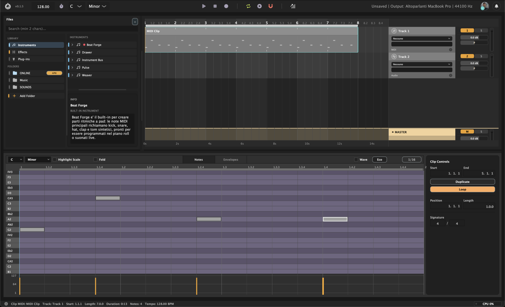

  

# DAWTONE Releases

This repository hosts the public downloadable builds for **DAWTONE**, a desktop music-production app and connected music community for macOS and Windows.

DAWTONE combines a timeline arrangement, MIDI clips, piano-roll editing, track controls, a browser for instruments/effects/plug-ins, and an online/local library workflow in one desktop app.

## Music Production And Community

DAWTONE is not only a music-production tool. It also includes a social layer where creators can publish their tracks, share them publicly, and receive audience feedback through the DAWTONE portal.

Registered users can also access DAWTONE's online library for downloadable creative resources, including samples, packs, plug-ins, and additional built-in devices/content as they become available.

For the best download experience, use the official DAWTONE website:

**[Download DAWTONE](https://dawtone-software.web.app/#download)**

The website shows the current macOS and Windows builds, install notes, and the voluntary **pay me a coffee** support step before the download starts.

## Support And Download

DAWTONE is currently free to download and use.

Before downloading from the official site, you can choose:

- `0` to download for free
- a suggested support amount
- a custom amount through the open contribution option

Paid support is optional, but it helps fund development, testing, and new DAWTONE releases. Please use the official website flow instead of direct payment links, so the download and support steps stay connected to the latest release.

## Multilingual Support

DAWTONE includes multilingual interface support. The current app translations are:

- English
- Italian
- French
- German
- Spanish
- Russian
- Chinese
- Japanese

## Available Builds

Each GitHub Release contains:

- `DAWTONE-macOS-<version>.zip` for macOS
- `DAWTONE-Windows-<version>.zip` for Windows

The newest public version is marked as **Latest** on the Releases page.

## Install Notes

### macOS

Download the macOS ZIP, extract it, then open `DAWTONE.app`.

Current builds are not Apple-notarized. macOS or Chrome may warn that the file is uncommon or from an unidentified developer. This is expected for unsigned independent test builds.

### Windows

Download the Windows ZIP, extract it, then run `DAWTONE.exe` from the extracted folder.

Windows SmartScreen or the browser may warn about uncommon downloads while DAWTONE is still early and unsigned.

## About This Repository

This repository is only for public release binaries and release metadata. The recommended entry point for users is always the official DAWTONE website:

**[dawtone-software.web.app](https://dawtone-software.web.app/)**
